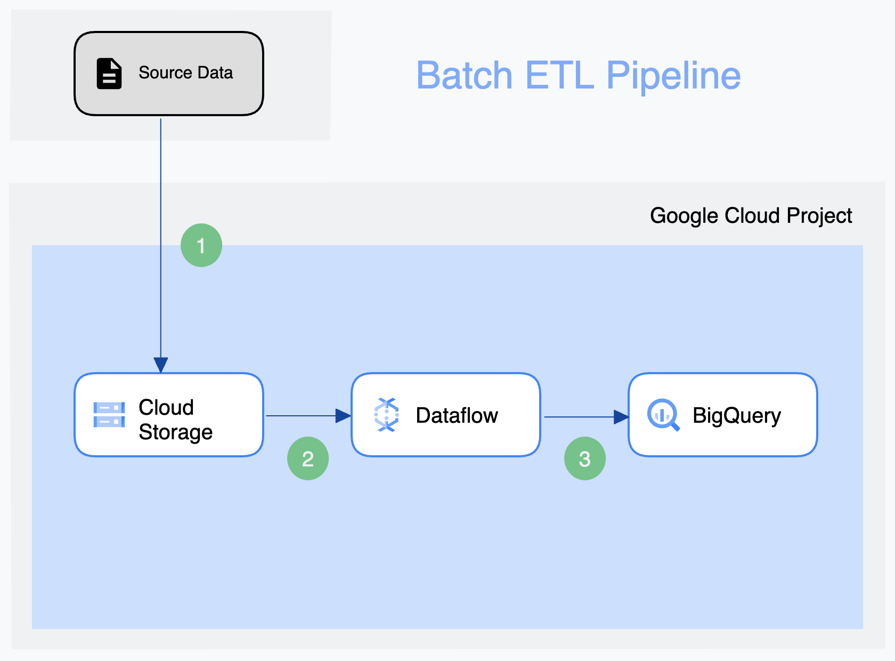
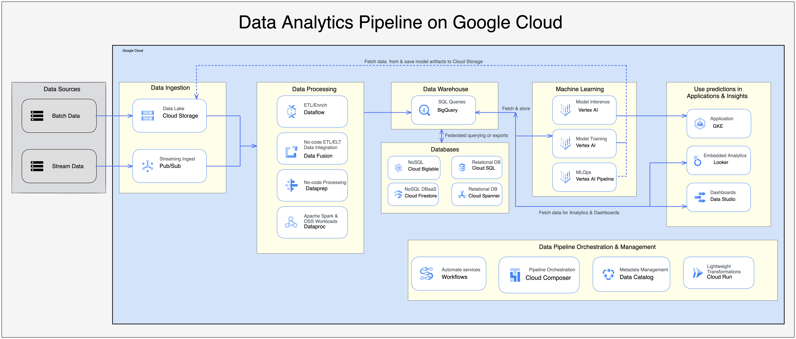

# DataScientest News Feed

> Repo d'un cas d'usage du projet centré sur l'API `Times Wire` du NY Times

- [DataScientest News Feed](#datascientest-news-feed)
  - [Objectifs](#objectifs)
    - [Fonctionnalités](#fonctionnalités)
      - [1. Data Analytics](#1-data-analytics)
      - [2. Web Dev](#2-web-dev)
      - [3. DataOps](#3-dataops)
      - [4. DevOps](#4-devops)
    - [Architecture](#architecture)
  - [Documentation](#documentation)
    - [Analyse exploratoire](#analyse-exploratoire)
    - [Structure](#structure)
  - [Pour démarrer le projet](#pour-démarrer-le-projet)

## Objectifs

### Fonctionnalités

#### 1. Data Analytics

- [ ] Construire un pipeline ETL de traitement des données:
  - [ ] capable de les traiter par batch,
  - [X] extraites de l'API Times Wire
    - [ ] vers une solution de stockage des données bruts,
  - [ ] transfomées pour être utilisable dans notre cas d'usage,
  - [ ] renvoyées vers une base de données
    - [ ] répondant aux besoins analytiques et/ou applicatifs du cas d'usage,

#### 2. Web Dev

- [ ] Construire une application démontrant l'utilisabilité des données affinées:
  - [ ] avec un back-end pour manipuler ces données (-> FastAPI),
  - [ ] un front-end pour afficher le résultat et/ou interagir avec les données,

#### 3. DataOps

- [ ] Améliorer le fonctionnement du projet:
  - [ ] développer une solution d'orchestration du pipeline ETL (-> Airflow),
  - [ ] transférer le projet dans une solution cloud (-> GCP)
  - [ ] ajouter une data warehouse pour piloter les interactions avec les données (-> BigQuery),

#### 4. DevOps

- [ ] Améliorer le développement du projet en mettant en place un workflow de CI/CD:
  - [ ] mettre en place un process pour documenter le projet (-> Sphinx)
  - [ ] construire un pipeline de CI,
    - [ ] avec un workflow déclenché automatiquement (-> GitHub Workflows), #FIXME
    - [ ] tester les fonctionnalités du code (-> pytest),
    - [X] valider la qualité du code (-> black, isort, flake8, bandit, safety)
  - [ ] construire un pipeline de CD:
    - [ ] automatisant le dépoiement des micro-services du projet:
    - [ ] containeriser les composants du projet (-> Docker/Kubernetes),
    - [ ] adapter le projet dans une architecture IaC (-> Terraform),

### Architecture

Exemples d'architecture visé (si on atteint l'étape d'implantation dans GCP):

  

  

## Documentation

### Analyse exploratoire

Ce projet collecte des données à partir de l'[API Times Wire](https://developer.nytimes.com/docs/timeswire-product/1/overview) du NY Times.

Vous pouvez récupérer la collection de tests des endpoints du portail développeur du NY Times:  

  

### Structure

Les éléments principaux de ce repo sont organisés par logique fonctionnelle:

  - Data Pipeline:
    - `etl`
      - `extract`
      - `transform`
      - `load`
  - Web App:
    - `api`
      - `backend`
      - `frontend`
  - DataOps:
    - `orchestration`

## Pour démarrer le projet

- clonez le repo
- créez un environnement virtuel dédié au projet
- installez [`poetry`](https://python-poetry.org/) pour administrer les packages Python
  - des outils modernes comme `poetry` ou `pipenv` sont préconisés pour la gestion des dépendances spécifiés dans un fichier `toml`,
  - mais plusieurs outils de DevOps préconisent de revenir à `pip` et des fichiers `txt` pour lancer des job dans des environnements virtuels dédiés
